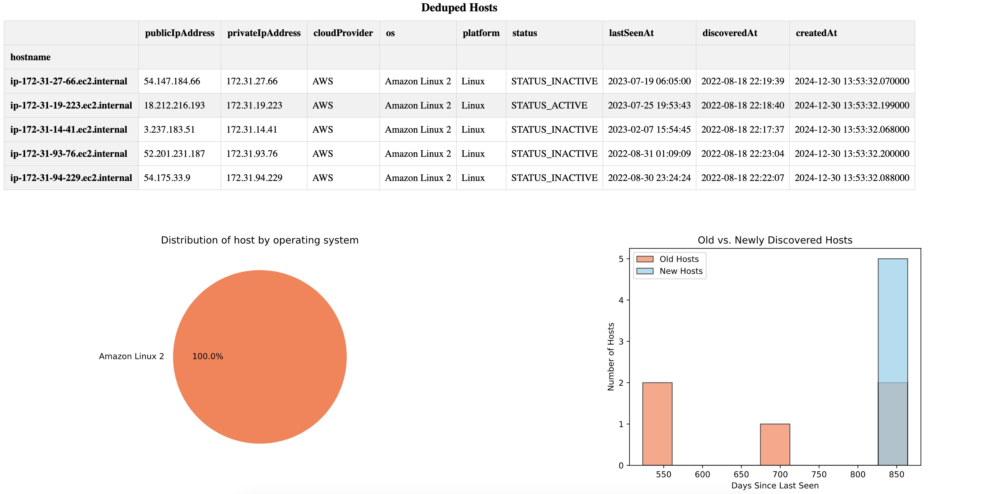

## Pipeline | A complex data pipeline.
### Configure
```
COPY .env-dist .env
```
Change the values.

### Run the project
```
docker compose run app bash -c "flask pipeline --skip=0 --limit=2 --total=10" --remove-orphans
docker compose up app
```
The command allow to proceed >1M
```
flask pipeline [OPTIONS]

Options:
  -sc, --skip_collecting BOOLEAN
  -sa, --skip_aggregating BOOLEAN
  -exit, --exit_on_failure BOOLEAN
  -s, --skip INTEGER
  -l, --limit INTEGER
  -t, --total INTEGER
  --help                          Show this message and exit.

```

Results you can see in browser:
 * *Running on http://localhost:5005/*

